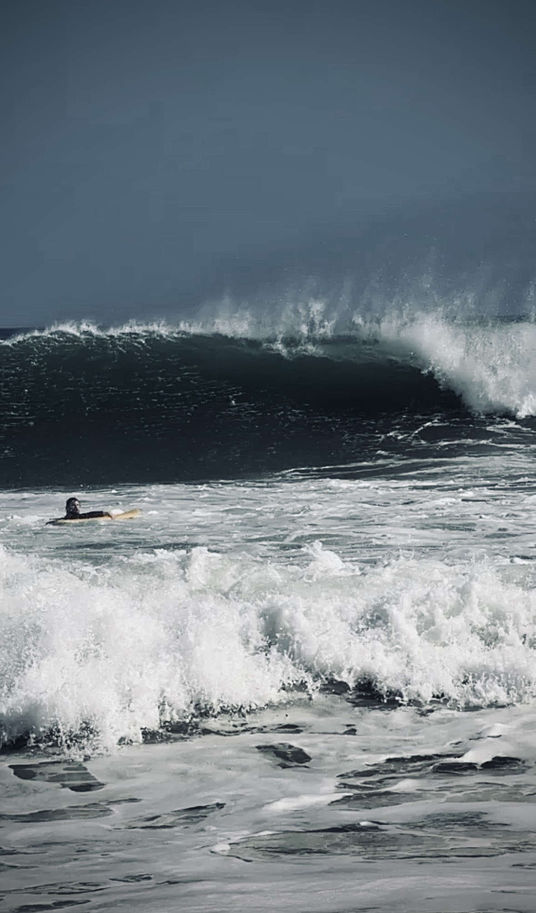

I went to Nicaragua expecting clean, peeling waves and empty user-friendly breaks. What I got was a swell that was too far out of my comfort zone, packed and competitive lineups, and a sense of "I don't belong out here". 

Initially, it was disheartening. But surf trips rarely go according to the forecast, and this one ended up showing me a few blind spots I needed to confront.

## A thought about fear.

One of the clearer lessons from the trip is that I still don't respond particularly well to fear.

In Nicaragua, fear showed up in two distinct forms. The first was physical: the raw power of heavy sets unloading on a shallow sand bar, the relentless current dragging against my fried shoulders. The second was mental: the fear of looking stupid or out of place in a crowded pack of experienced surfers. Both of these exposed a glaring lack of confidence in myself and my abilities, and once that fear takes root in your chest, it's difficult to break.

What I realized on this trip is that this isn't unique to surfing. It's the same exact thing that shows up on a motorcycle when racing around a tight and techincal line, or when dropping into a steep chute at the mountain; when the risk of injury is perceived, the instinctual fear arises. Regardless of your actual technical ability, this feeling, can make you freeze up, lose confidence, and ultimately not perform at your best.

Often times, my natural response to this feeling is to pull off the gas, and perhaps even lower my own expectations of myself. Recognizing that response is half the battle. Breaking it requires setting the ego aside, taking a breath, and refusing to let adrenaline dictate my mechanics.

## Stop rushing, enjoy the process.

The other lesson was about pace. I often catch myself trying to rush through life. Whether it's surfing, BJJ, or motorcycling, my default instinct has been to go hard, go fast, and constantly push myself with often unobtainable goals and arbitrary marks of progress.

In surfing, that means forcing maneuvers on a wave, choosing the wrong board for the conditions because I think it's "cool" or because I think its necessary for my progression. In BJJ, it means becoming over-exerting during a roll instead of relying on technique and placing the value on the optics of colored belts (again, a colored belt is "cooler" than a white belt) rather than experience. In motorcycling, it meant buying more powerful bikes thinking speed and gadgets would compensate for skill.

At the end of the day, I realize that these all fall under another common thread, it comes down to a lack of patience. Coming back from this trip and reflecting, it has finally dawned on me that I can't rush an ocean that doesn't care about my timeline. Instead of always chasing the next milestone, I need to learn to love the process, and in turn let the progress come naturally. In this way I can maximize the enjoyment I get out of life.

Progress doesn't come from pushing the gas pedal when conditions get tough. Most of the time, it comes from getting comfortable with discomfort and having the discipline to ***just let it happen***.
